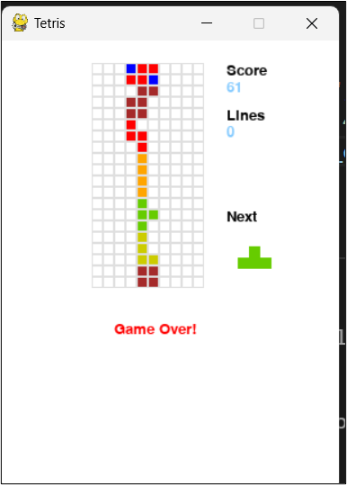
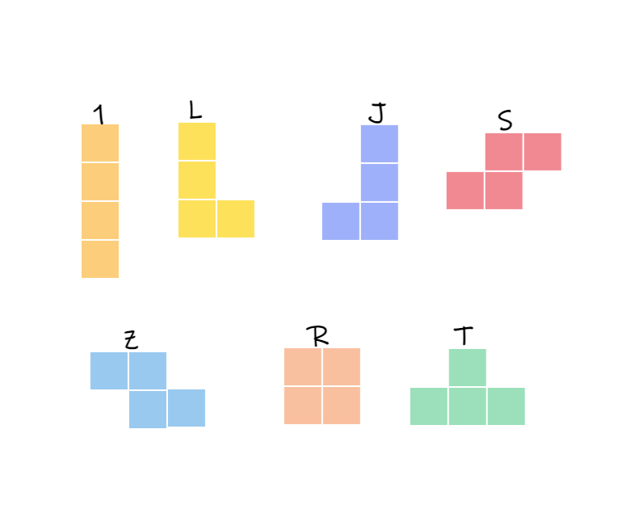
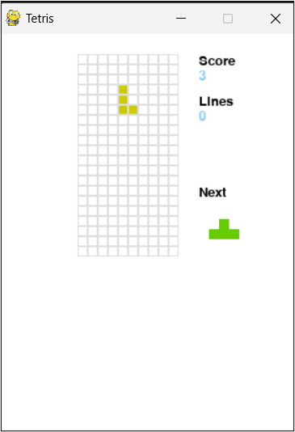
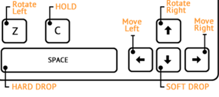

<h1>Tetris</h1>
Project development TPJ 

<h1>Introduction</h1>
The main goal of the subject TPJ is to pick a game to develop, where we can apply the patterns we learn in class.  
I chose Tetris, because I had an interest in knowing how it worked since I played the game so many times when I was young

<h1>How tetris works</h1>
The purpose of the game is to move pieces, that decends onto the playing field, until a line is clear, that means all squares of the grid are fill with color.  
The game ends when there is no space on grid to play. Just like example below.  

<h2>Possible Pieces</h2>
Tetris has 7 possible pieces and the pieces are: (the colors in this image are similar to the program)

<h2>Layout</h2>
Hold piece (when we want to use current piece for later), score info, lines clear, level, next piece, falling piece and grid for playing (displaying proposes)  
The level, hard drop (space key) and hold (c key) were not implemented. 
The dimension of the pygame window is 300x400. 
The grid used has 10 row for 20 columns. 

   

<h1>Commands</h1>
The possible commands that programs uses is 

from https://tetris.com/play-tetris/

<h1>Validate space</h1>
The movement of the piece is restrict to the grid, so before user press the direction or rotation, a verification need to occur   
To do that I create a list with free pos of the dimension of the grid containing 200 squares of possible positions.

<h1>Rotation</h1>
Exists two possible rotations clock an anticlockwise for all pieces except the square.  
For rotation i adapted the code from (line 122 - 125)
https://github.com/StanislavPetrovV/Python-Tetris/blob/master/main.py

<h1>Struct Program</h1>
The program is divide into files.  
<ul>
  <li>piece.py - information about piece of tetris like their coordinates, tipe, and color </li> 
  <li>scoreboard.py - information about the score of the game like number of score, number of lines clear</li> 
  <li>screen_play.py where it has information about the grid used to play tetris on pygame.</li> 
  <li>commands.py possible inputs of the game</li>
  <li>game.py - main class, where program runs</li>
 </ul>
 

<h1>Patterns</h1>
- Command: Used to handle keyboard inputs.  
- Observer: Used to record events in game - done with log file.  
- Game Loop: Logic of the game - process input -> update game -> render - time to process.  
- Update: Update frames using sprite - need to coloring pieces on tetris.   
